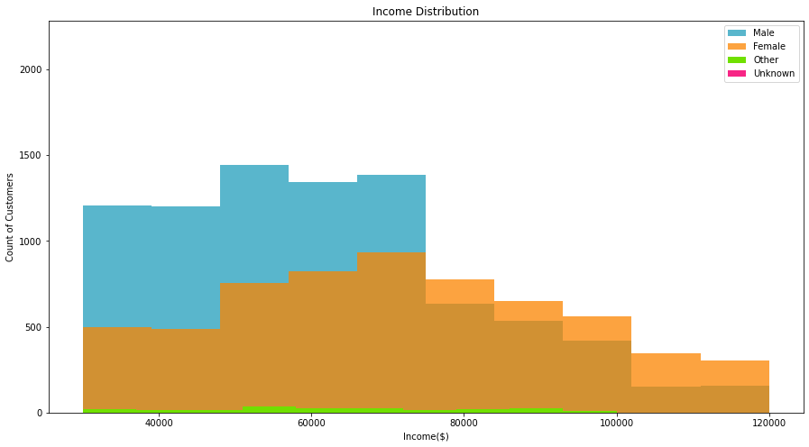
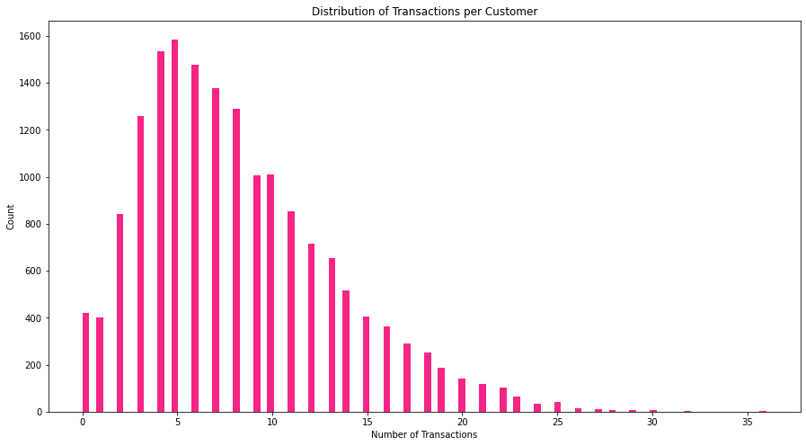

# Udacity Data Scientist Nanodegree
## Starbucks Capstone Challenge
Sorcha Nic Conmara 
November 29, 2021

## I. Project Definition

---

### Project Overview

---

This project combines transaction, demographic and offer data from the Starbucks rewards app to determine which demographic groups respond 
best to which offer type via a number of questions and exploratory data analysis. This project also produces a supervised machine 
learning model to predict whether a customer is likely to complete an offer on their own (without influence) or as a 
direct result of viewing the offer in the app beforehand (with influence).

For this capstone challenge, I'm particularly interested in investigating the customer demographics, the offers portfolio and the transcripts data to answer a few questions such as:

**Q1.** What was the age distribution of Starbucks customers in the dataset?

**Q2.** What was the distribution of customer tenure in the dataset?

**Q3.** What year saw the most new memberships and what month of the year saw the most memberships?

**Q4.** What was the gender distribution of customers in the Starbucks dataset? 

**Q5.** What was the income distribution by gender?

**Q6.** What was the income distribution by age group?

**Q7.** What was the distribution of events in the transcript dataset?

**Q8.** Was there a pattern in the release of offers?

**Q9.** What was the distribution of transaction amounts?

**Q10.** What were the most common offer types by channel?

**Q11.** What were the distributions for duration, reward and difficulty of offers?

**Q12.** What was the mean spend and number of transactions by gender?

**Q13.** What offer types were most popular across age groups and income groups?

**Q14.** What offer types were most popular across genders and membership years?

Following on from this, I train a supervised propensity model to predict **the propensity of a customer completing an offer WITHOUT any influence from the app versus a customer completing an offer as a direct result of viewing an offer from the app (influenced).** Ideally, a model such as the one in this notebook would be used to help to identify which customers would be most responsive to receiving an offer and would be likely to view it and complete it. It would also help to identify those customers likely to complete the offer regardless and therefore wouldn't necessarily need to receive the offer.

The project data sets contain simulated data that mimics customer behavior on the Starbucks rewards mobile app. 
Once every few days, Starbucks sends out an offer to users of the mobile app. An offer can be merely an advertisement
for a drink or an actual offer such as a discount or BOGO (buy one get one free). Some users might not receive any offer 
during certain weeks.

Every offer has a validity period before the offer expires. As an example, a BOGO offer might be valid for only 5 days. 
We see in the data set that informational offers have a validity period even though these ads are merely providing 
information about a product; for example, if an informational offer has 7 days of validity, we can assume the customer 
is feeling the influence of the offer for 7 days after receiving the advertisement.

The transactional data shows user purchases made on the app including the timestamp of purchase and the amount of money 
spent on a purchase. This transactional data also has a record for each offer that a user receives as well as a record 
for when a user actually views the offer. There are also records for when a user completes an offer. It's also worth 
noting that someone using the app might make a purchase through the app without having received an offer or seen an offer.

---
### Problem Statement

---

We are interested in predicting which customers are likely to complete the offer regardless and which are likely to 
complete the offer after being influenced to do so.

There are a few challenges with this data:
- not all users receive the same offer
- a user can receive an offer, never view the offer but still 'complete' the offer according to the data
- a user can also 'complete' an offer without having received nor viewed it according to the data

For example, a user might receive the "buy 10 dollars get 2 dollars off offer", but the user never opens the offer 
during the 10 day validity period. The customer spends 15 dollars during those ten days. There will be an offer completion 
record in the data set; however, the customer was not influenced by the offer because the customer never viewed the offer.

Also, some demographic groups will make purchases even if they don't receive an offer. From a business perspective, 
if a customer is going to make a 10 dollar purchase without an offer anyway, you wouldn't want to send a buy 10 dollars 
get 2 dollars off offer. We want to try to assess what a certain demographic group will buy when not receiving any offers.

We will attempt to solve this problem by building a supervised machine learning model to classify customers into two
target variable groups. The model will be built, trained, refined and evaluated in order to produce the highest accuracy score we can.
An accuracy score between 0.7-0.9 is acceptable, with an accuracy score of > 0.9 indicating overfitting.
For the classification model, a customer was given a **target value of 1 (event)** if they had **completed the offer 
after having viewed the offer.** It is assumed that a customer would have had to receive the offer in order for it to be 
possible for them to view it in the app. If a customer **completed the offer without viewing, viewed the offer after 
completing it or completed the offer without receiving or viewing it,** they were assigned a **target value of 0 (non-event).**

More specifically, the steps involved in the production of the model were as follows:

1. Raw data read in from JSON files
2. Datsets explored, pre-processed and cleaned individually
3. Exploratory Data Analysis carried out
4. Data Visualisations created
5. New features engineered
6. Data prepped for modelling (scaling, label encoding, etc)
7. Baseline models built, trained and evaluated
8. GridSearchCV run on more extensive hyperparameters
9. Final Best Model fom GridSearchCV (LightGBM) evaluated
10.  Conclusion, insights and possible improvements noted
---
### Metrics

---
The metric chosen to evaluate the supervised model was accuracy. Accuracy is the proportion of true results among the 
total number of cases examined. This metric was chosen because the model was a binary classification model and accuracy 
allowed me to assess how well the model was at correctly predicting the target variable. Accuracy also takes both true 
positives and negatives into account with equal weight.

<center><strong>Accuracy = (TP+TN)/(TP+FP+FN+TN)</strong></center>


The final best model this project produced was a LightGBM classifier which returned an accuracy score of 0.74.


When we look at the confusion matrix, we  can see that had:
  
- **True Positive:**&emsp;&emsp;&emsp;4846
  
- **True Negative:**&emsp;&emsp;&ensp;1269
  
- **False Positive:**&emsp;&emsp;&emsp;903
  
- **False Negative:**&emsp;&emsp;1278

 

In the case of our data, a false positive implies that a customer was incorrectly classified as having completed an offer after viewing it when they did not.
A false negative implies that a customer was incorrectly classified as having completed an offer without viewing it beforehand when they did view the offer before completing it.
The possible danger here is that for our false negative customers, they would likely not complete an offer without receiving and viewing it first, therefore we should still send them offers.
Also, if the number of false positive customers was too high, we risk wasting money sending out offers to those customers when they completed the offer without viewing it beforehand.


## II. Analysis

---
### Data Exploration & Data Visualisation

---
### Datasets
The data is contained in three files:

* **portfolio.json** - containing offer ids and meta data about each offer (duration, type, etc.)
* **profile.json** - demographic data for each customer
* **transcript.json** - records for transactions, offers received, offers viewed, and offers completed

Here is the schema and explanation of each variable in the files:

**portfolio.json**
* **id (string)** - offer id
* **offer_type (string)** - type of offer ie BOGO, discount, informational
* **difficulty (int)** - minimum required spend to complete an offer
* **reward (int)** - reward given for completing an offer
* **duration (int)** - time for offer to be open, in days
* **channels (list of strings)**
---
**profile.json**
* **age (int)** - age of the customer 
* **became_member_on (int)** - date when customer created an app account
* **gender (str)** - gender of the customer (note some entries contain 'O' for other rather than M or F)
* **id (str)** - customer id
* **income (float)** - customer's income
---
**transcript.json**
* **event (str)** - record description (ie transaction, offer received, offer viewed, etc.)
* **person (str)** - customer id
* **time (int)** - time in hours since start of test. The data begins at time t=0
* **value - (dict of strings)** - either an offer id or transaction amount depending on the record

---
### Summary of Exploratory Data Analysis

---
The following summary describes the chaarcteristics of the datasets obtained from the initial exploratory data analysis.

#### 1. Profile Data:
- There are 17,000 customers in the dataset.
- 2,175 customers are missing income, age and gender from the dataset.
- ~50% of customers are male, ~36% are female, ~1.25% are other and ~12.75% are unknown.
- Ages range from 18-101 with a default age of 118 poulated for 2,175 customers missing an age in the dataset.
- The most common age groups are 55-64(3,421), 45-54(3,013) and 65-74 (2,457).
- Mean age is 62.
- Mean income is ~65k, incomes range from ~30k to ~120k.
- Mean income is higher for females than males and others.
- Customer tenure in months range from 0 months to 60 months (5years).
- 2017 was the busiest year in terms of new memberships, and overall, memberships were steady month by month over the years.





#### 2. Transcript Data:
- There are 306,534 transcript records.
- There are 4 distinct types of events - offer received, offer viewed, offer completed and transaction.
- The days since test start range from 0 to 29 days.
- The following were the mean days since test start for each event type: 
   
   Offer received:	 13.86 days
   
   Offer viewed:	 14.46 days
   
   Offer completed: 16.35 days
   
   Transactions:	 15.53 days

- Transactions were the most common event types, followed by offer received, offer viewed and offer completed.
- On average, customers completed 8 transactions and have a mean transaction amount of ~$13
- When looking at the distribution of days since test start, we can see clear spikes on days 0,7,14,21 which suggests that tests commence weekly.
- No missing values.





#### 3. Portfolio Data:
- 10 unique offers in the portfolio of offers.
- Offers can be bogo (buy one get one free), discount or  informational  offers.
- Offers can come from web, email mobile or social channels.
- The most popular channels for bogo offers were email and mobile.
- The most popular channels for discount offers were email and web.
- The most popular channels for informational offers were email and mobile.


## III. Methodology

---
### Data Pre-processing

---

The following pre-processing steps were carried out on each dataset initially:

#### 1. Profile Data:
- ```became_member_on``` converted to date
- ```membership_year``` attribute created
- customer ```tenure_in_months``` calculated as of end of July 2018
- Nulls in ```gender``` filled with 'U' for 'Unknown'
- Nulls in ```income``` imputed with median income value and ```income``` datatype converted to int.
- ```missing_income``` column created which indicates if ```income``` was Null
- ```age_group``` column created which bins the ages
- ```income_group``` column created which bins the incomes

#### 2. Transcript Data:
- ```offer id``` and ```transaction_amount``` columns created from extracting data from ```value``` column
- ```time``` converted from hours to days to create column ```days_since_test_start```
- ```person``` renamed to ```customer_id```
- ```time``` renamed to ```time_hours```

#### 3. Portfolio Data:
- ```offer_type``` was one hot encoded using pd.get_dummies()
- ```channels``` was one hot encoded using a MultiLabelBinarizer
- Original ```channels``` and ```offer_type``` columns dropped

#### 3. Final Modelling Dataset:
- transcript and profile datasets merged on customer_id 
- portfolio dataset merged with resulting dataframe from previous point
- ```customer_id```, ```offer_id```, ```gender```, ```membership_year```, ```age_group``` and ```income_group``` were encoded using LabelEncoder()
- ```days_since_test_start```, ```age```, ```became_member_on```, ```income``` and ```transaction_amount``` were dropped
- ```duration``` was renamed to ```duration_hours```
- dataset was sorted by ```customer_id```, ```offer_id``` and ```time_hours``` to ensure the data was correct for the target creation
- target variable ```target``` was engineered using the logic defined in the 'Problem Statement' of this report
- once the target variable was calculated for all rows, only the rows where ```event``` == ```offer completed``` were kept as we were only interested in predicting whether a completed offer was influenced or not
- ```customer_id``` and ```event``` were dropped before modelling
- dtypes of columns were adjusted
- ```time_hours```, ```tenure_in_months```, ```reward```, ```difficulty``` and ```duration_hours``` were scaled using MinMaxScaler()
- non-unique dummy columns ```channel_email``` and ```offer_informational``` were dropped before modelling
- correlation matrix was produced to examine relationships between attributes
- data was split into attributes and target and then into training and testing sets before modelling

**Correlation Matrix:**


---
### Implementation

---
A number of initial models with limited hyperparameter tuning were first trained, fit and tested to serve as a
baseline to compare the results of the GridSearchCV with. These models were:

- Random Forest Classifier
- Logistic Regression Classifier
- Light Gradient Boosting Machine Classifier (LightGBM)
- Linear Support Vector Classifier (LinearSVC)
- Stochastic Gradient Descent Classifier (SGDC) 

```
## Random Forest
# Model Object
rdf = RandomForestClassifier(n_estimators=500, random_state=RANDOM_STATE)

## LGR
# Model Object
lgr = LogisticRegression(random_state=RANDOM_STATE, solver="saga")

## Light Gradient Boosting Machine
# Model Object
gbm = lgbm.LGBMClassifier(random_state=RANDOM_STATE)

## SVC
# Model Object
lsvc = LinearSVC(random_state=RANDOM_STATE)

## SGD Classifier
# Model Object
sgdc = SGDClassifier(random_state=RANDOM_STATE)
```

```
model_list = [lgr, rdf, gbm, lsvc, sgdc]

for model in model_list:
    # fit model
    model.fit(X_train, y_train)
    # predict
    y_pred = model.predict(X_test)
    # print evaluation metrics
    print_line("Model:")
    print(model)
    print_line("Confusion Matrix:")
    print(confusion_matrix(y_pred, y_test))
    print_line("Classification Report:")
    print(classification_report(y_pred, y_test))
```

The intitial baseline models all produced acuuracy scores between 0.72 and 0.74 with LightGBM producing the best accuracy. 
I had always intended to run a GridSearch and therefore kept the parameters very basic initially.

---
### Refinement

---
When running the full GridSearchCV with multiple hyperparamters, LightGBM was also the best model overall, producing an 
accuracy score of 0.74. The following were the model objects and parameters tested:

```
## LGR

# Model Object
lgr = LogisticRegression(class_weight="balanced", 
                         random_state=RANDOM_STATE, 
                         solver="saga", 
                         C=1, 
                         warm_start=False,
                         max_iter=500, 
                         penalty="elasticnet",
                         l1_ratio=1)
# LGR Parameters
p_grid_lgr = {'model': [lgr],
              'model__C': np.logspace(-3, 3, 7),
              'model__l1_ratio': [0, 0.4, 0.6, 0.8, 1]}

## Random Forest

# Model Object
rdf = RandomForestClassifier(class_weight="balanced", 
                             random_state=48, 
                             n_estimators=100, 
                             oob_score=False, 
                             max_depth=None)
# RDF Parameters
p_grid_rdf = {'model': [rdf],
              'model__n_estimators': [80, 90, 100, 150, 200],
              'model__min_samples_leaf': [3, 5, 10, 20, 35, 50],
              'model__max_features': ["sqrt", "log2"]}

## Light Gradient Boosting Machine

# Model Object
gbm = lgbm.LGBMClassifier(class_weight="balanced", 
                          random_state=RANDOM_STATE, 
                          boosting_type="gbdt", 
                          tree_learner="serial", 
                          objective="binary")
# LGBM Parameters
p_grid_gbm = {'model': [gbm],
              'model__n_estimators': [90, 100, 200],
              'model__max_depth': [3, 12, 63, -1],
              'model__num_leaves': [8, 35, 143, 3968],
              'model__feature_fraction': [0.7, 0.8, 0.9, 1]}
## SVC

# Model Object
lsvc = LinearSVC(class_weight='balanced',
                 penalty='l2',
                 dual=False,  # Prefer dual=False when n_samples > n_features.
                 random_state=RANDOM_STATE)
# SVC Parameters
p_grid_lsvc = {'model': [lsvc],
               'model__C': np.logspace(-3, 3, 7)}

## SGD Classifier

# Model Object
sgdc = SGDClassifier(random_state=RANDOM_STATE, 
                     loss='log',
                     penalty='elasticnet',
                     class_weight='balanced')
# SGD Parameters
p_grid_sgdc = {'model': [sgdc],
               'model__alpha': np.logspace(-6, 2, 10),
               'model__l1_ratio': np.linspace(0, 1, 10)}

# Parameters
p_grid = [p_grid_gbm, p_grid_lsvc, p_grid_rdf, p_grid_sgdc, p_grid_lgr]

## Model Training Pipeline

# Cross Validation Folds

# Stratified CV Count
cv = StratifiedKFold(n_splits=3)

# SMOTE - Artificial Data to better balance the unbalanced events
smote = SMOTE(random_state=RANDOM_STATE)

# Pipeline Steps
steps = [('SMOTE', smote),
         ('model', None)]

# Grid
model_pipe = imb_pipeline(steps)

grid = GridSearchCV(model_pipe,
                   param_grid=p_grid,
                   cv=cv,
                   scoring='accuracy',
                   n_jobs=-1,
                   verbose=2)
```
The GridSearch fitted 3 folds for each of 394 candidates, totalling 1182 fits.
```
%%time
# Model Training

# Grid Fit/Score
grid.fit(X_train, y_train)
grid.score(X_test, y_test)

# Model Extraction
model = grid.best_estimator_['model']
```

The final model parameters were as follows:

```LGBMClassifier(class_weight='balanced', feature_fraction=0.7, max_depth=63,n_estimators=200, num_leaves=35, objective='binary',random_state=42, tree_learner='serial')```

```class_weight='balanced'``` - modifies the loss function by giving more/less penalties to the classes with more (or less) weight

```feature_fraction=0.7``` - 70% of features are selected before training each tree

```max_depth=63``` - this is the maximum tree depth

```n_estimators=200``` - this is the number of boosted trees to fit

``` num_leaves=35``` - this is the maximum number of tree leaves for base learners

```objective='binary'```- this specifies the learning task

```random_state=42``` - this is the random number seed

```tree_learner='serial'``` - this is the default tree_learner (single machine tree learner)

[source 1](https://lightgbm.readthedocs.io/en/latest/pythonapi/lightgbm.LGBMClassifier.html)

[source 2](https://datascience.stackexchange.com/questions/52627/why-class-weight-is-outperforming-oversampling)


## IV. Results

---
### Final Model Evaluation

---
```
### Model Evaluation and Validation

### Model Evaluation

## Model Prediction
y_pred = model.predict(X_test)

print(classification_report(y_test, y_pred))

plot_conf_mat(y_test, y_pred)
```

**Classification Report:**

                precision    recall  f1-score       support

           0        0.58      0.50      0.54          2547
           1        0.79      0.84      0.82          5749

    accuracy                            0.74          8296
    macro avg       0.69      0.67      0.68          8296
    weighted avg    0.73      0.74      0.73          8296

**Confusion Matrix:**

When we look at the confusion matrix, we  can see that had:

- **True Positive:**&emsp;&emsp;&emsp;4846


- **True Negative:**&emsp;&emsp;&ensp;1269
  

- **False Positive:**&emsp;&emsp;&emsp;903
  

- **False Negative:**&emsp;&emsp;1278


**Important Features:**


The 3 most important features in this model were the **time in hours since the start of the test**, the **customer's tenure in months** and the **age group** of the customer.

---
### Justification

---

As mentioned previously, **LightGBM was the best model overall**, producing an 
**accuracy score of 0.74** which was better than the other models in the baseline. 

"LightGBM is a gradient boosting framework that uses tree based learning algorithms" 
[(source)](https://lightgbm.readthedocs.io/en/latest/) and was likely the best model because it is better in terms
of performance an speed and also it "produces more complex trees by following leaf-wise split approach rather than a 
level-wise approach" [(source)](https://www.analyticsvidhya.com/blog/2017/06/which-algorithm-takes-the-crown-light-gbm-vs-xgboost/#:~:text=Better%20accuracy%20than%20any%20other,by%20setting%20the%20max_depth%20parameter.) 
which allows for better accuracy.

Given that we previously established that an accuracy between 0.7-0.9 was acceptable, I believe that this model successfully 
answers the question posed and is valid. 


## V. Conclusion

---
### Reflection

---

In conclusion, this project **successfully answered the questions I set out to answer via exploratory data analysis and also produced a relatively accuracte supervised machine learning model** to idneitfy customers who would complete an offer without influence and those who would complete an offer as a direct result of viewing the offer in the app beforehand. 

The questions posed and answered above:

**Q1.** What was the age distribution of Starbucks customers in the dataset?

**Q2.** What was the distribution of customer tenure in the dataset?

**Q3.** What year saw the most new memberships and what month of the year saw the most memberships?

**Q4.** What was the gender distribution of customers in the Starbucks dataset? 

**Q5.** What was the income distribution by gender?

**Q6.** What was the income distribution by age group?

**Q7.** What was the distribution of events in the transcript dataset?

**Q8.** Was there a pattern in the release of offers?

**Q9.** What was the distribution of transaction amounts?

**Q10.** What were the most common offer types by channel?

**Q11.** What were the distributions for duration, reward and difficulty of offers?

**Q12.** What was the mean spend and number of transactions by gender?

**Q13.** What offer types were most popular across age groups and income groups?

**Q14.** What offer types were most popular across genders and membership years?

**The final accuracy of the LightGBM model was 0.74.**

For a company like Starbucks, this type of a model would be useful in creating **targeted marketing** towards customers likely to be influenced to complete offers rather than simply targeting the entire customer base or those who would complete the offer regardless. This would save Starbucks money if for example they used SMS campaigns or postal campaigns for example. They could also **avoid sending offers to customers who would complete the offer regardless in order to increase profits.**

---
### Personal Insights

---

An aspect I found slightly difficult was the target variable creation.
The challenges surrounding the target variable creation were as follows:
- not all users receive the same offer
- a user can receive an offer, never view the offer but still 'complete' the offer according to the data
- a user can also 'complete' an offer without having received nor viewed it according to the data

I solved this by applying the following logic:

- a customer was given a **target value of 1 (event)** if they had **completed the offer after having viewed the offer.** It is assumed that a customer would have had to receive the offer in order for it to be possible for them to view it in the app. 

- If a customer **completed the offer without viewing, viewed the offer after completing it or completed the offer without receiving or viewing it,** they were assigned a **target value of 0 (non-event).**

Interestingly, I learned several unexpected things from exploring the Starbucks dataset such as:

- below average and average income customers had nearly the same amount of transactions compared to those with above average income. Customers with average income completed the most offers, followed by those with below average income and those with above average income.

- when looking at income distribution by gender, the average income of Starbucks customers is higher for females than for males. The distribution of female incomes is also wider and less-skewed than the male income distribution. However, both male and female incomes range from 30k to 120k.

Overall, the experience gained from data wrangling, data exploration, 
data visualisation, feature engineering, data encoding, data scaling, model development and model evaluation has undoubtedly benefitted me and helped me to improve my skills as an aspiring data scientist.

---
### Improvement

---
To improve on the current model's performance, we could use a GPU-enabled version of LightGBM to train a model faster [(source)](https://lightgbm.readthedocs.io/en/latest/GPU-Tutorial.html). Early stopping could also be experimented with. Early stopping means that "after each boosting round the model’s training accuracy is evaluated against a validation set that contains data not available to the training process. That accuracy is then compared to the accuracy as of the previous boosting round. If the model’s accuracy fails to improve for some number of consecutive rounds, LightGBM stops the training process" [(source)](https://lightgbm.readthedocs.io/en/latest/Parameters-Tuning.html#use-early-stopping).

-----------
