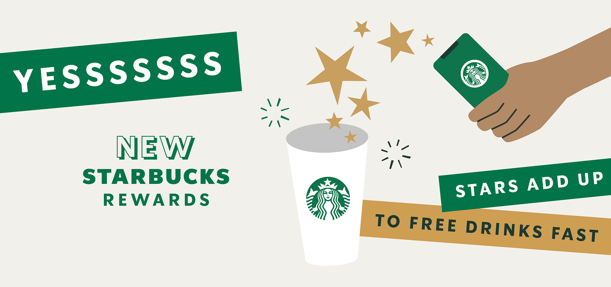

# Starbucks Capstone Challenge

### Udacity Data Scientist Nanodegree Capstone

---

#### Author: Sorcha Nic Conmara | November 2021

---

### Description:

---
This project combines transaction, demographic and offer data from the Starbucks rewards app to determine which demographic groups respond best to which offer type via a number of questions and exploratory data analysis. This project also produces a supervised machine learning model to predict whether a customer is likely to complete an offer on their own (without influence) or as a direct result of viewing the offer in the app beforehand (with influence).

For this capstone challenge, I'm particularly interested in investigating the customer demographics, the offers portfolio and the transcripts data to answer a few questions such as:

Q1. What was the age distribution of Starbucks customers in the dataset?

Q2. What was the distribution of customer tenure in the dataset?

Q3. What year saw the most new memberships and what month of the year saw the most memberships?

Q4. What was the gender distribution of customers in the Starbucks dataset?

Q5. What was the income distribution by gender?

Q6. What was the income distribution by age group?

Q7. What was the distribution of events in the transcript dataset?

Q8. Was there a pattern in the release of offers?

Q9. What was the distribution of transaction amounts?

Q10. What were the most common offer types by channel?

Q11. What were the distributions for duration, reward and difficulty of offers?

Q12. What was the mean spend and number of transactions by gender?

Q13. What offer types were most popular across age groups and income groups?

Q14. What offer types were most popular across genders and membership years?

Following on from this, I train a supervised propensity model to predict the propensity of a customer completing an offer WITHOUT any influence from the app versus a customer completing an offer as a direct result of viewing an offer from the app (influenced). Ideally, a model such as the one in this notebook would be used to help to identify which customers would be most responsive to receiving an offer and would be likely to view it and complete it. It would also help to identify those customers likely to complete the offer regardless and therefore wouldn't necessarily need to receive the offer.

The result is a LightGBM classifier which returns an accuracy score of 0.74.

---
### File Structure:

---
    
- **starbucks_capstone_challenge.ipynb** - Jupyter notebook with code
    
- **README.md** - readme

- **Project_Report.md** - project report
  
- **images/** - saved data visualisations used in project report

- **data/** 
    * **portfolio.json** - containing offer ids and meta data about each offer (duration, type, etc.)
    * **profile.json** - demographic data for each customer
    * **transcript.json** - records for transactions, offers received, offers viewed, and offers completed

    Here is the schema and explanation of each variable in the files:
    
    **portfolio.json**
    * **id (string)** - offer id
    * **offer_type (string)** - type of offer ie BOGO, discount, informational
    * **difficulty (int)** - minimum required spend to complete an offer
    * **reward (int)** - reward given for completing an offer
    * **duration (int)** - time for offer to be open, in days
    * **channels (list of strings)**
    ---
    **profile.json**
    * **age (int)** - age of the customer 
    * **became_member_on (int)** - date when customer created an app account
    * **gender (str)** - gender of the customer (note some entries contain 'O' for other rather than M or F)
    * **id (str)** - customer id
    * **income (float)** - customer's income
    ---
    **transcript.json**
    * **event (str)** - record description (ie transaction, offer received, offer viewed, etc.)
    * **person (str)** - customer id
    * **time (int)** - time in hours since start of test. The data begins at time t=0
    * **value - (dict of strings)** - either an offer id or transaction amount depending on the record

___

### Libraries Used:

---

- numpy==1.19.1
- pandas==1.2.4
- matplotlib==3.3.1
- seaborn==0.11.0
- scikit-learn==0.23.2
- scipy==1.6.2
- lightgbm==3.0.0
- imblearn==0.0

---
### Acknowledgements

---
* [Starbucks | Data](https://www.starbucks.com/)
* [Starbucks | Banner Image](https://stories.starbucks.com/emea/stories/2020/introducing-the-new-starbucks-rewards/)
* [Udacity | Data Scientist Nanodegree](https://www.udacity.com/course/data-scientist-nanodegree--nd025)
